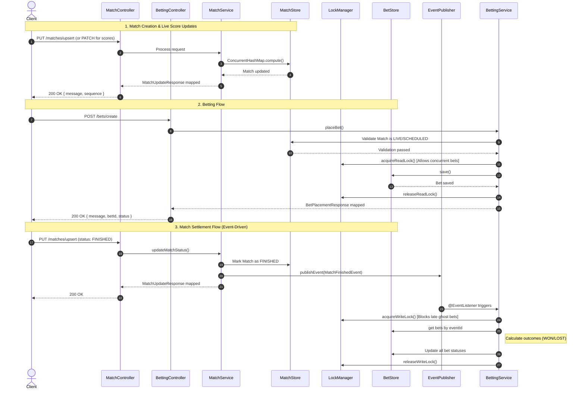

# Real Winner: Bally's Football Betting Service

## Overview
RealWinner is a lightweight service for managing football match events and user betting predictions. The concept behind the name is simple: regardless of which team wins or loses a match, the real winner is the person who correctly predicts the outcome.A single-instance Spring Boot REST API that manages football matches, live score updates, and bet settlements based on timed sequence arrivals. It handles "win" and "draw" bets, validating inputs and automatically settling pending bets when a match status changes to "finished".

Because this application is required to run without an external database, it uses advanced Java concurrency features to handle thousands of requests per second safely, ensuring no data is lost or corrupted when multiple updates happen at the exact same millisecond.

## 🚀 Tech Stack
* **Java 21**
* **Spring Boot 3.3.x**
* **In-Memory Storage:** `ConcurrentHashMap` (No external database)
* **Testing:** JUnit 5, Mockito
* **Documentation:** Springdoc OpenAPI (Swagger)

---

## 🧠 Architecture & Thread Safety

Handling live sports data requires strict thread safety. We cannot let two network requests overwrite each other. To solve this without a database, this application uses a **Two-Tier Locking Strategy**:


### 1. Data-Level Locks (For High-Speed Updates)
For fast, frequent updates like live scores, we use `ConcurrentHashMap.compute()`.
* **Why?** It locks only the specific match being updated, not the entire map.
* **Benefit:** If Match A gets two score updates at the same time, they are processed one after the other safely. Meanwhile, users can still freely update Match B without waiting.

### 2. Domain-Level Locks (To Prevent "Ghost Bets")
What happens if a user places a bet at the *exact same millisecond* a match finishes? To prevent saving a "Ghost Bet" on a finished game, we built a custom `EventLockManager` using `ReentrantReadWriteLock`.
* **Placing a Bet (Read Lock):** Thousands of users can place bets concurrently on a LIVE match without slowing each other down.
* **Finishing a Match (Write Lock):** When a match finishes, the system claims a "Write Lock". This temporarily pauses new bets for *that specific match only*, settles all pending bets accurately, and then permanently locks the match.

---

### 🔄 Application Event Flow

---
## 📌 Business Rules & Assumptions

### Match Handling
* **Strict Lifecycle & Ordering:** Matches must follow a strict status progression: `SCHEDULED` -> `LIVE` -> `FINISHED`. Events are expected to arrive in order. Out-of-order state transitions are rejected.
* **Score Constraints:** Scores are strictly accepted only when a match is `LIVE`. If a score arrives for a `SCHEDULED` match, it is rejected to maintain consistency, rather than implicitly promoting the match to `LIVE`.
* **Out-of-Order Delivery & Race Conditions:** If a score update arrives before the system has processed the transition to `LIVE` (e.g., a score event overtakes the status event on the network), the score update is strictly rejected to protect state integrity. The system assumes that live sports data streams continuously broadcast the current score, meaning any prematurely rejected scores will be naturally corrected by subsequent upstream updates once the match is officially `LIVE`.
* **No Downward Score Corrections (The VAR Trade-off):** Because the incoming `ScoreRequest` payload lacks a strict monotonic sequence number or timestamp, the system cannot mathematically distinguish between a delayed network message (e.g., an old 0-0 arriving late) and a deliberate score deduction (e.g., a VAR overturned goal). Therefore, to guarantee state integrity against network latency, the system strictly drops lower scores. VAR corrections are considered out of scope for this iteration.
* **Immutability & Locks:** * Matches cannot be deleted once created.
  * Once a match transitions to `LIVE`, the participant entities cannot be altered.
  * Once a match is `FINISHED`, no further score or status updates are permitted.
* **Idempotency:** Incoming events are only processed if they mutate the state or score. Duplicate updates are ignored to prevent artificial sequence increments.
* **Data Retention:** The system retains only the absolute latest score (no historical time-series). Data is ephemeral and stored entirely in JVM memory, which is assumed sufficient for the single-instance load.
* **Football Constraints:** A match strictly consists of two participants. If a match finishes without any received score updates, the outcome is automatically calculated as a DRAW.
* **Delegated Upstream Validations:** The upstream event publisher (e.g., Kafka) is treated as the absolute source of truth. Validations such as "teams playing in two locations simultaneously" or "match name matching the team names" are intentionally considered out of scope for this bounded context.
* **Querying & Pagination:** Matches are returned strictly ordered by their update sequence. Pagination is not required for this iteration.
* **Security & Users:** Authentication, authorization, and rate-limiting are bypassed. `userId` is treated as a pass-through string without validation.

### Bet Handling
* **Strict Placement Prerequisites:** To successfully place a bet, the match must exist, and the chosen participant must be actively playing in that specific match.
* **Single Bet Limitation:** A user is strictly limited to placing a single bet per match. Subsequent attempts to wager on the same event (e.g., hedging) will be rejected.
* **No Score-Based Betting Suspensions (The "Sure Bet" Loophole):** The system allows bets to be placed at any time while a match is `LIVE`, regardless of the current score. It does not actively block a user from placing a "certain win" bet late in a game where one team has acquired an mathematically unchaseable lead (e.g., 50-0). Implementing dynamic betting suspensions based on time remaining or extreme score differentials is considered out of scope for this iteration.
* **Bet Immutability:** Once a bet is placed, it is final. Users cannot update or delete existing bets.
* **Event Reconciliation:** Handling message consumption failures (e.g., the Bet Service failing to consume a Match Finished event) is considered out of scope for this exercise's current architecture.

---

## 🧪 Test Coverage & Key Scenarios Validated

The application includes a robust JUnit 5 and Mockito test suite designed to validate complex domain rules and concurrency edge cases.
### A Note on Integration Testing
Full end-to-end integration tests (e.g., `@SpringBootTest` with `TestRestTemplate` or Testcontainers) were intentionally omitted from this iteration.
Because this application relies entirely on an in-memory data store (`ConcurrentHashMap`) and has no external infrastructure dependencies (like PostgreSQL, Redis, or an external Kafka broker), the service-level tests effectively act as functional integration tests. They validate the complete lifecycle of a request from domain logic down to the persistence layer. In a future production iteration where external databases and message brokers are introduced, infrastructure-level integration tests would be added.
### 1. Match Domain Validations
* **State Transition Enforcement:** Asserts that a match cannot skip states (e.g., `SCHEDULED` directly to `FINISHED`) and throws exceptions on illegal transitions.
* **Live Match Immutability:** Asserts that once a match is `LIVE`, attempts to change the match name or participant entities are strictly rejected.
* **Out-of-Order Score Defense:** Asserts that if a lower score arrives after a higher score is already recorded, the lower score is discarded.
* **Early Score Rejection:** Asserts that score updates sent for a `SCHEDULED` match are rejected.
* **The "Scoreless Draw":** Asserts that a match transitioning from `LIVE` to `FINISHED` without any score updates naturally settles as a DRAW.

### 2. Betting Domain Validations
* **Participant Validation:** Asserts that a user cannot place a `WIN` bet on a team that is not actively playing in the specified match.
* **Draw Validation:** Asserts that a `DRAW` bet cannot include a specific participant ID.
* **Single Bet Limitation:** Asserts that if a user attempts to place a second bet on the same match (e.g., hedging), the request is rejected.
* **Event-Driven Settlement:** Asserts that when a `MatchFinishedEvent` is published, all `PENDING` bets for that match are correctly mapped to `WON` or `LOST` based on the final score.

### 3. Concurrency & Race Conditions (Multi-threaded Tests)

* **The "Starting Gun" Score Test:** 100 threads attempt to update the score of a single LIVE match at the exact same millisecond. Validates that `ConcurrentHashMap.compute()` safely processes all updates without dropping a score or allowing an older score to overwrite the highest value.
* **The "Ghost Bet" Prevention Test:** 100 threads attempt to place a bet while 1 thread simultaneously attempts to transition the match to `FINISHED`. Validates that the `ReentrantReadWriteLock` correctly rejects bets that arrive after the write-lock is claimed, ensuring 0 pending bets remain on a completed match.

## 🛠️ How to Run

### Prerequisites
* Java 21 installed on your machine.
* Maven (Optional, as the project includes the Maven Wrapper).

### Running Locally
Open your terminal in the project folder and run:

```bash
# 1. Clean and build the project
./mvnw clean install

# 2. Start the application
./mvnw spring-boot:run
Once running, you can view the fully documented Swagger UI at:

👉 http://localhost:8080/swagger-ui.html

Note: The application includes a DataSeeder that automatically creates a few test matches, adds scores, and places some bets on startup so you can immediately test the GET endpoints!
It is commented but will run when uncommented.

📡 API Reference & Examples

1. Create or Update Match Status
Creates a new match or updates its status.

Endpoint: PUT /matches/upsert

Request Payload:

JSON
{
  "eventId": "E004",
  "name": "Serie A Clash",
  "participants": [
    { "id": "P007", "name": "Juventus" },
    { "id": "P008", "name": "AC Milan" }
  ],
  "status": "scheduled"
}
Response (200 OK):

JSON
{
  "message": "Match event added",
  "sequence": 14
}
2. Update Scores
Updates the current score for a LIVE match.

Endpoint: PATCH /matches/scores

Request Payload:

JSON
{
  "eventId": "E003",
  "scores": {
    "P006": 1,
    "P005": 2
  }
}
Response (200 OK):

JSON
{
  "message": "Score updated",
  "sequence": 16
}
3. Query Matches
Retrieves all matches currently in memory, sorted sequentially by their update arrival.

Endpoint: GET /matches/query

Response (200 OK):

JSON
[
  {
    "eventId": "E001",
    "name": "Arsenal vs Chelsea",
    "participants": [
      { "id": "P001", "name": "Arsenal" },
      { "id": "P002", "name": "Chelsea" }
    ],
    "status": "finished",
    "scores": {
      "P002": 0,
      "P001": 2
    },
    "sequence": 4,
    "outcome": {
      "winnerParticipantId": "P001"
    }
  },
  {
    "eventId": "E002",
    "name": "El Clasico",
    "participants": [
      { "id": "P003", "name": "Real Madrid" },
      { "id": "P004", "name": "Barcelona" }
    ],
    "status": "finished",
    "scores": {
      "P003": 1,
      "P004": 1
    },
    "sequence": 8,
    "outcome": {
      "winnerParticipantId": null
    }
  },
  {
    "eventId": "E003",
    "name": "Der Klassiker",
    "participants": [
      { "id": "P005", "name": "Bayern Munich" },
      { "id": "P006", "name": "Dortmund" }
    ],
    "status": "live",
    "scores": {
      "P006": 1,
      "P005": 2
    },
    "sequence": 12
  },
  {
    "eventId": "E004",
    "name": "Serie A Clash",
    "participants": [
      { "id": "P007", "name": "Juventus" },
      { "id": "P008", "name": "AC Milan" }
    ],
    "status": "scheduled",
    "scores": null,
    "sequence": 13
  }
]
4. Place a Bet
Places a new WIN or DRAW bet for a user.

Endpoint: POST /bets/create

Request Payload:

JSON
{
  "eventId": "E006",
  "userId": "U001",
  "betType": "win",
  "participantId": "Dum2"
}
Response (200 OK): ```json
{
"message": "Bet placed",
"betId": "B9a8b4c82",
"status": "pending"
}


### 5. Get User Bets
Retrieves all bets for a specific user. Filter by status (`live` or `settled`).
* **Endpoint:** `GET /bets/{userId}?status=live`
* **Response (Live / Pending):**
```json
[
  {
    "betId": "B56115c1b",
    "eventId": "E003",
    "betType": "win",
    "participantId": "P005",
    "status": "pending"
  }
]
Endpoint: GET /bets/{userId}?status=settled

Response (Settled):

JSON
[
  {
    "betId": "B5c61875e",
    "eventId": "E001",
    "betType": "win",
    "participantId": "P001",
    "result": "won"
  },
  {
    "betId": "B9a8b4c82",
    "eventId": "E006",
    "betType": "win",
    "participantId": "Dum2",
    "result": "won"
  },
  {
    "betId": "B56115c1b",
    "eventId": "E003",
    "betType": "win",
    "participantId": "P005",
    "result": "lost"
  }
]

🧪 Automated Test Suite
This project includes a comprehensive JUnit 5 test suite.

To run the tests:

Bash
./mvnw test
